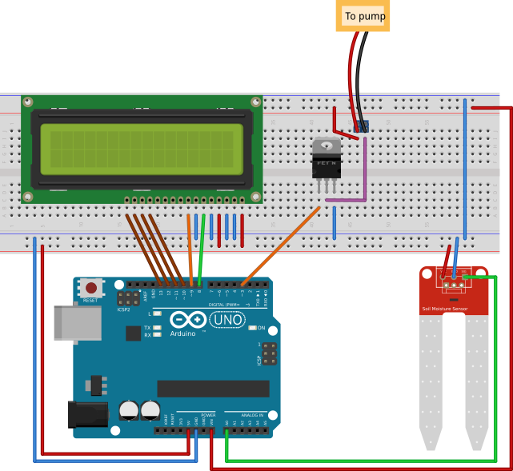
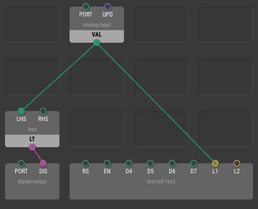
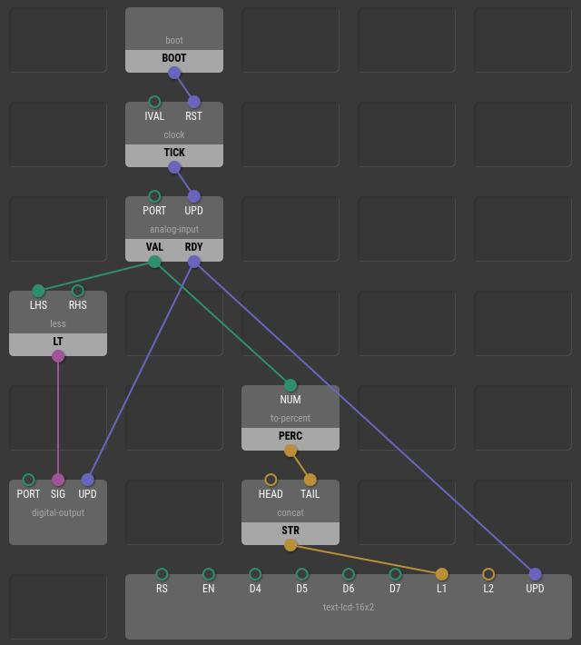
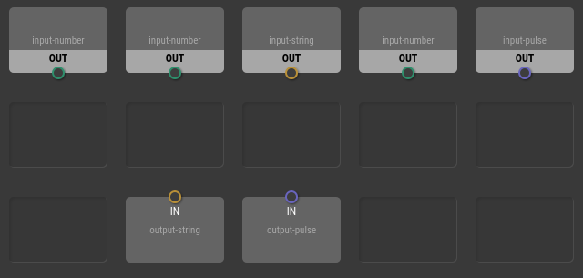
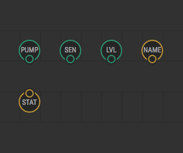
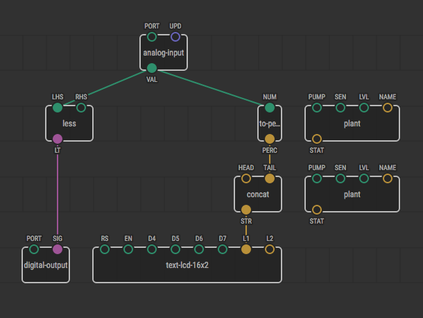
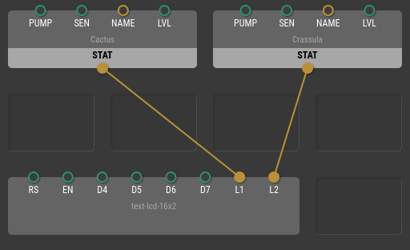
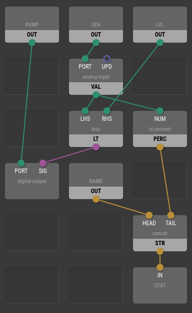
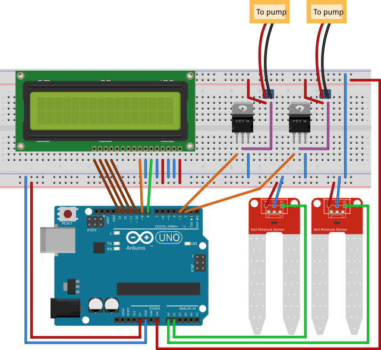

Patch Nodes
===========

What you see on the tab in the main workspace is called a *patch*. A XOD patch
corresponds to a single source file or module in other programming languages.

Until now, you’ve created single-patch programs and the patch was
automatically named `main`. Creating a whole project in a single patch would
become messy once the number of nodes and links passed some limit. It is often
a good idea to split complex patches into several simpler patches that are
easier to understand and edit.

Furthermore, you can reuse patches several times in your project with slightly
different parameters, thus avoiding node duplication.

When you use one patch as a node in other patches it is called a *patch node*.

In this chapter, we’re going to build a simple watering station for two plants.
The idea is to water a plant if its soil became too dry and constantly show the
current soil measurements on an LCD screen.

Single plant station on a single patch
--------------------------------------

To start, let's build a device that will work with a single plant. We’ll use
a single patch called `main`, as in previous chapters.

Create a new project called `water-station` and wire up your circuit:

Now make the following patch to control the device:

Be sure to set port values properly for all hardware nodes.

You may have noticed it is very similar to the previously implemented smart
light project. We've only changed the sensor and the actuator. The moisture
sensor replaced the light sensor, and the pump replaced the LED.

Upload the program to your board and test the device. Put the sensor into a
glass of water and take it out. See how the pump reacts. Observe the text
shown on the LCD.

Let’s improve the program a bit by adding pretty formatting to the messages
so that instead of `"0.42"`, the LCD would show something like `"Cactus: 42%"`.
We achieve this by adding two nodes. First, a `to-percent` node will convert a
number from the sensor to a string like `"42%"`. Second, the `concat` node will
concatenate the constant prefix `"Cactus: "` with the percent string:

Hint
You can click the help button

in Inspector or Project Browser next to a node name to open node’s reference
and learn what the node does.

Extracting plant logic to a separate patch
------------------------------------------

So far, so good. Now consider that we want to extend the device to handle two
plants at once. We have another sensor, yet another relay, and a pump. What we
want to share is the LCD. Each plant’s message should be shown on its own line.

The very staightforward way to do it would be to duplicate most of nodes
related to reading and comparing data, and formatting the result. But it would
quickly become unmanagable and error prone. Changes in one place would always
require manually mirroring those changes in other places.

Patch nodes to the rescue. What do the different plants have in common? And
what is different? The logic is common, but the name of the plant and its
watering threshold value differ. The ports used to connect the sensor and the
relay are also different. So these things need to be provided as parameters to
our patch.

What might the patch output to the outside world? It could be a status message
string.

Create a new patch with File → New Patch, and name it `plant`. Look at
Project Browser. You’ll see that a `plant` patch has appeared next to our
`main`.

First of all, we’re going to define its inputs and outputs. Expand
`xod/patch-nodes` in Project Browser and notice nodes with names like
`input-xxx` and `output-xxx`. They are called *terminals*, and define the
patch's input and output pins. Place a few inputs and outputs according to what
we’ve planned to parametrize:

Now give the terminal nodes informative labels so we can remember which one
means what:

Switch back to the `main` patch and try to add two nodes of our newly created
type `plant`:

We’re going to use these two nodes to manage plants and move the existing
logic to the shared `plant` patch. Let’s do it.

XOD T0D0
Currently there is no cut/copy/paste in XOD. Yes, that’s a pain. We’ll
implement it in future versions. If you would like to give the feature more
priority, we welcome you to <a href="//forum.xod.io">share your opinion on our
forum</a>.

Here is the final `main` patch:

And the `plant` patch:

Wire up the circuit:

Set parameters for your plants with Inspector. Then upload the program and see
how both plants are served simultaneously with a single patch.

What’s next
-----------

Our quick tutorial is almost complete. The last thing to learn is what you can
do to build arbitrary projects with arbitrary hardware. See the [Complex
Projects](../complex-projects/) chapter to learn more.
