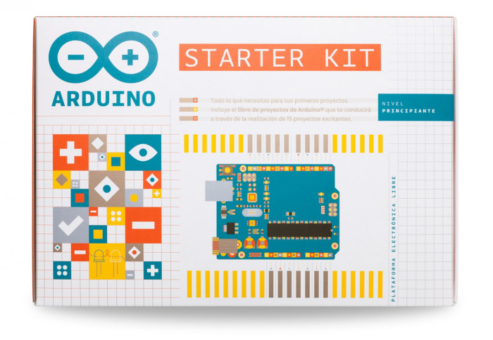

# Required Hardware

XOD is not tied to a particular vendor of hardware. It is compatible with
various controller boards, sensors, and peripherals devices that can be
programmed with Arduino IDE.

Nevertheless, for the best experience with this tutorial we recommend you
using [Arduino Starter Kit](https://store.arduino.cc/usa/arduino-starter-kit?utm_source=xodio&utm_medium=xod&utm_campaign=tutorial)
because it contains all the components you’ll need to complete the lessons.

## Components you’ll need

* 1× Arduino (or compatible) board
* 1× USB cable
* 1× Breadboard
* 2× LED
* 1× TMP36 temperature sensor
* 1× Servo
* 2× Tactile buttons
* 1× Photoresistor (aka LDR)
* 1× Potentiometer
* 2× 220 or 330Ω resistors
* 3× 10kΩ resistors
* Jumper wires

## Ready?

Go to the [first lesson →](../01-hello)
